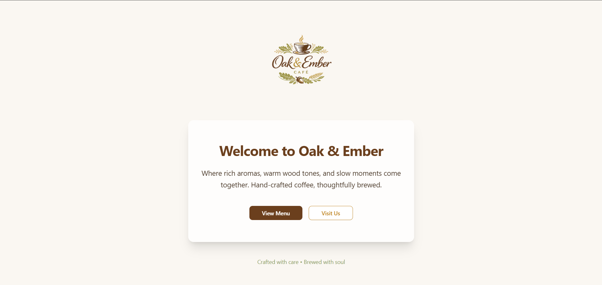
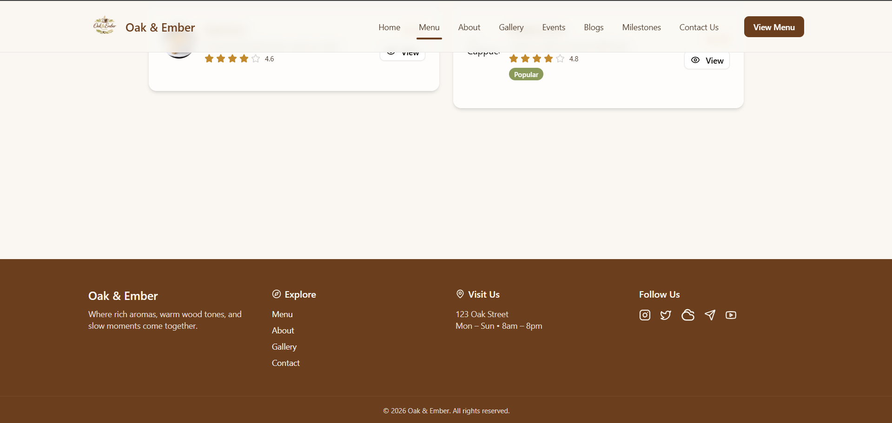
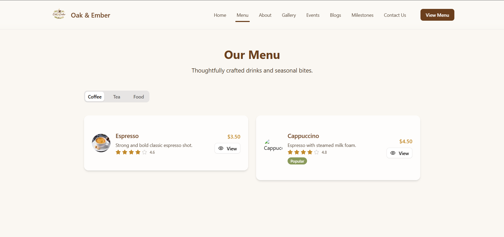
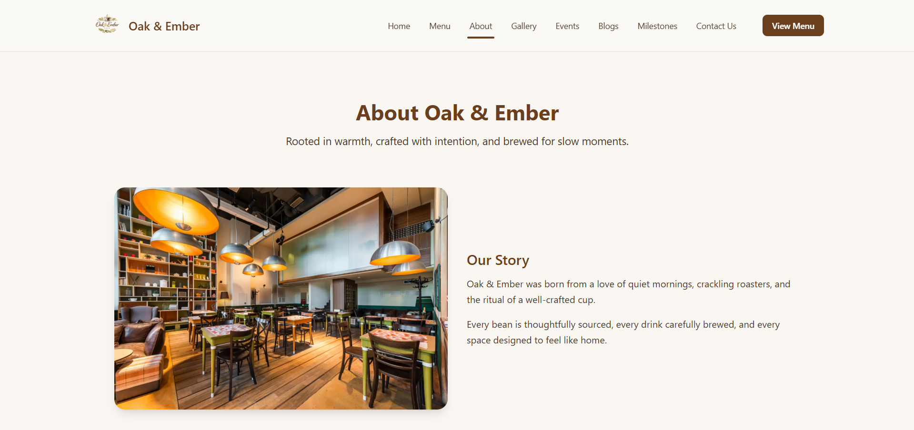
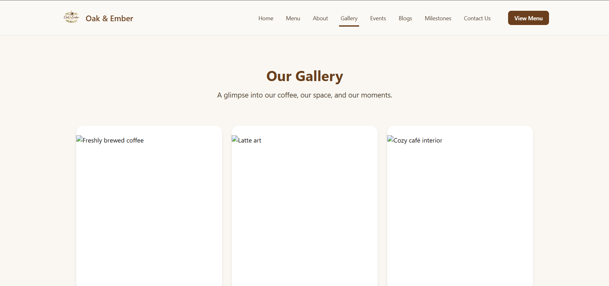
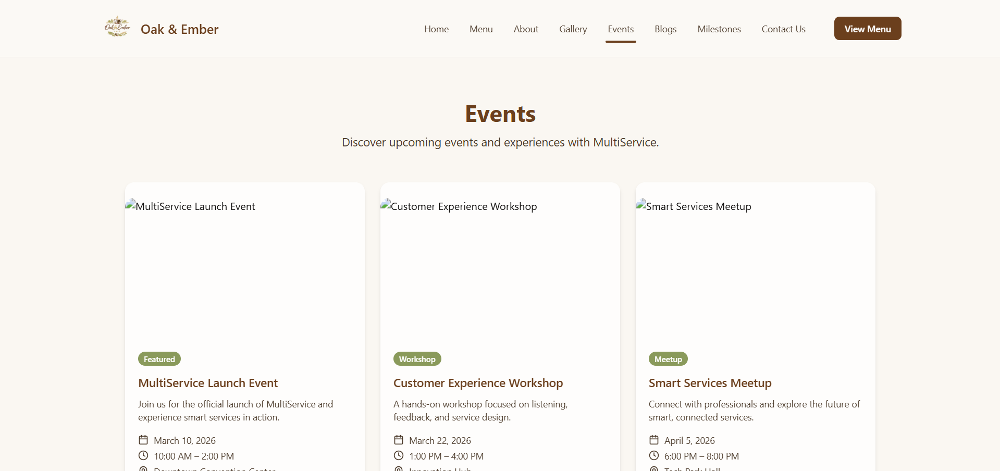
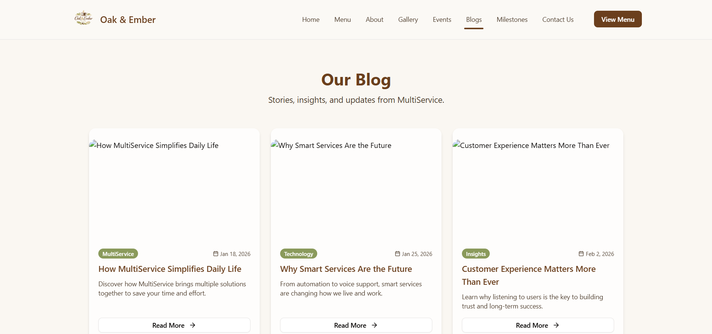
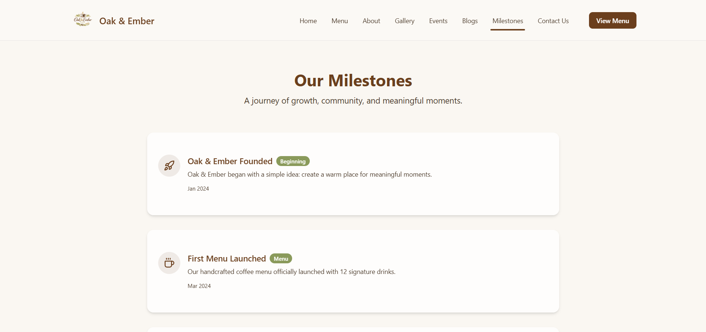
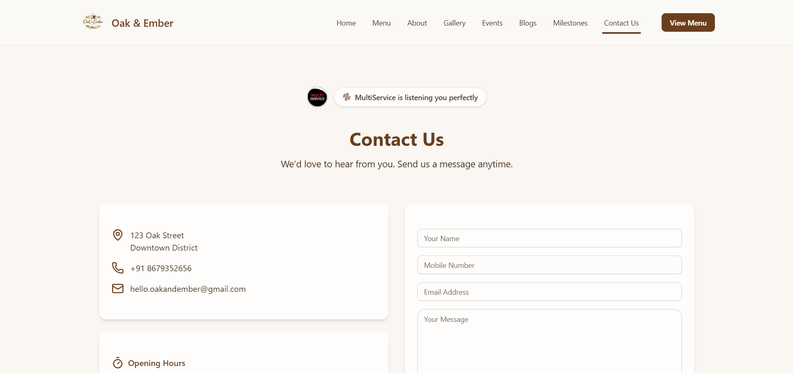

# ☕ Oak & Ember

**Oak & Ember** is a modern café website built with a warm wood-and-fire aesthetic.  
It features a dynamic menu system, blog & event pages, gallery, milestones, and Telegram-powered contact messaging.

Built with ❤️ using **Next.js App Router, TypeScript, Node.js, shadcn/ui, and Telegram Bot API**.

---

## 🚀 Tech Stack

- **Framework:** Next.js (App Router)
- **Language:** TypeScript
- **Backend Runtime:** Node.js
- **UI Library:** shadcn/ui
- **Styling:** Tailwind CSS
- **API Integration:** Telegram Bot API
- **Routing:** File-based routing (App Router)

---

## 📂 Project Structure

```
src/
 ├── app/
 │   ├── layout.tsx
 │   ├── page.tsx                 → Home (/)
 │   │
 │   ├── (main)                   → Main Layout Group
 │   │   ├── about/               → /about
 │   │   ├── blogs/               → /blogs
 │   │   ├── contact-us/          → /contact-us
 │   │   ├── events/              → /events
 │   │   ├── gallery/             → /gallery
 │   │   ├── menu/                → /menu
 │   │   └── milestones/          → /milestones
 │   │
 │   └── api/
 │       └── contact/route.ts     → Telegram API Route
 │
 └── data/
     └── menu/
         └── menuItems.json
```

---

## 🌐 Main Routes

```
/                → Home
/about           → About
/blogs           → Blogs
/contact-us      → Contact
/events          → Events
/gallery         → Gallery
/menu            → Menu
/milestones      → Milestones
```

---

# ☕ Menu System

The menu is dynamic and category-based.

## ➤ Add New Category or Item

Go to:

```
src/data/menu/menuItems.json
```

You can:
- Add new categories
- Add new items inside categories
- Update price, description, image, etc.

---

## ➤ Individual Menu Item Pages

Each menu item has a detailed route.

Example:

```
/menu/coffee/espresso
```

Folder structure:

```
src/app/(main)/menu/coffee/espresso/page.tsx
```

### To Create a New Item Page:

1. Go to:
   ```
   src/app/(main)/menu/<category-name>/
   ```

2. Create folder:
   ```
   item-name/
   ```

3. Inside it create:
   ```
   page.tsx
   ```

4. Copy layout from another item page and update content.

---

# 📝 Blog System

Each blog is folder-based.

## ➤ Blog Structure

```
src/app/(main)/blogs/
```

Example:

```
src/app/(main)/blogs/perfect-espresso-guide/page.tsx
```

Route:

```
/blogs/perfect-espresso-guide
```

---

## ➤ Create a New Blog

1. Navigate to:
   ```
   src/app/(main)/blogs/
   ```

2. Create a new folder:
   ```
   your-blog-slug/
   ```

3. Inside create:
   ```
   page.tsx
   ```

4. Update:
   - Title
   - Date
   - Author
   - Cover image
   - Content

---

## ➤ Add Blog to Listing Page

Open:

```
src/app/(main)/blogs/page.tsx
```

Add a new blog card linking to:

```
/blogs/your-blog-slug
```

---

# 🎉 Events System

Events work similar to blogs.

## ➤ Event Structure

```
src/app/(main)/events/
```

Example:

```
src/app/(main)/events/live-music-night/page.tsx
```

Route:

```
/events/live-music-night
```

---

## ➤ Create a New Event

1. Go to:
   ```
   src/app/(main)/events/
   ```

2. Create folder:
   ```
   event-slug/
   ```

3. Inside create:
   ```
   page.tsx
   ```

4. Update:
   - Event Title
   - Date & Time
   - Description
   - Banner image
   - Location info

---

## ➤ Add Event to Listing Page

Edit:

```
src/app/(main)/events/page.tsx
```

Add event card linking to:

```
/events/your-event-slug
```

---

# 🤖 Telegram Bot Integration

The contact form sends messages using Telegram Bot API.

API Route:

```
src/app/api/contact/route.ts
```

When a user submits the form:
- Message is sent to your Telegram chat
- Uses secure environment variables

---

# 🔐 Environment Variables

Create a `.env.local` file in project root:

```
TELEGRAM_BOT_TOKEN=your-telegram-bot-token
TELEGRAM_CHAT_ID=your_telegram_bot_chat_id
```

⚠️ Important:
- Never commit `.env.local`
- Add `.env.local` to `.gitignore`

---

# 🛠 Installation & Setup

## 1️⃣ Install Dependencies

```bash
npm install
```

## 2️⃣ Run Development Server

```bash
npm run dev
```

App runs on:

```
http://localhost:3000
```

---

# 📸 Screenshots

---

## 📸 Screenshots

### 🏠 Home Page


### Footer


### ☕ Menu Page


### About Page


### Gallery Page


### Events Page


### 📝 Blog Page


### Milestones Page


### 📩 Contact Page


---

# ✨ Features

- 🌲 Oak & Ember themed warm aesthetic
- 📱 Fully Responsive Design
- ☕ Dynamic Menu Categories
- 🧾 Individual Menu Item Pages
- 📝 Blog System
- 🎉 Events System
- 🖼 Gallery Section
- 🏆 Milestones Section
- 📩 Telegram Bot Contact Integration
- ⚡ Built with Next.js App Router

---

# 👨‍💻 Author

Created by **GlacioFrags** aka **Kyro**